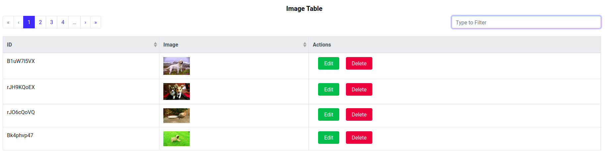

# Vue Editable Table Component

#### Project Details

Publish a `b-table` customized editable component **vue-table-editable** as a **NPM** module

Module Name: `vue-table-editable`
Latest version: `0.0.5`

####Component main configurations
* **tableOptions**

    name | feature descriptions | value
    ------ | -------| -------
   `ttAlign` | Table title alignment| `left` or `center`
   `ttText` | Table title text| any `text` can use 
   `ttFontsize` | Table title font size| any number with `px` (ex:`15px`)
   `ttColor` | Table title text color| act as css `color` property`
   `rHover` | Table rows hover| `true` or `false`
   `tBorder` | Table cells seperate with border| `true` or `false`
   `thColor` | Table header background color| `dark`,`light` and `none`
   `deleteAlertTitle` | Table row action confirmation alert message| ant text with type `string`
   `editable` | Table rows edit button show or hide| `true` or `false`
   `deletable` | Table rows delete button show or hide| `true` or `false`
   `filterFloats` | Table filter align direction| `left`, `center` or `right`
   `pgAlign` | Table pagination section alignment| `left`, `center` or `right`
   `pgPosition` | Table pagination display position| `top` or `bottom`
   `pgPerPage` | Table rows per page| use a `number` which more than 1
   `pgSize` | Table pagination display size| `sm`,`md` or `lg`
   `imgSize` | Table rows loading images size| `sm`,`md` or `lg`
    
* **items**
    * The type of the Data which pass to components should be an `Array` 

* **fields**

    name | feature descriptions | value
     ------ | -------| -------
     `key` | Table header map to items| any `text` that show the items data
     `label` | Table header show name| any `text` can use 
     `type` | Table column data type| `text`,`number` and `img`
     `sortable` | Table column want to sort|`true` or `false`
     `filterOn` | Column data want to filter| `true` or `false`

* **output-change**
    
    After edit or delete, a row in table sends an event called  `output-change` 
    * Return action `save` when row save after edit
    * Return action `delete` when row delete success
    

#####How to use editable table component
````    
First add <TableComponent></TableComponent> to vue file
Add props as below

                <TableComponent
                :items="itemsSet"
                :fields="fieldSet"
                :tableOptions="tableOptions"
                @output-change="handleOutput">
                </TableComponent> 
                
Update database when change happened in table rows (Edit or Delete)

                handleOutput(action, data) {
                    if (action === "delete") {
                        // remove data from database
                   } else if (action === "save) {
                        // update data in database
                    }
                }   
                
Test node version: v10.17.0                                  

````


#####Use only edit button and hide delete button. Table title color change into green 


#####Use only edit and delete buttons. Filter and pagination both are in top of the table


#####Edit the row when click the edit button


#####Load images in a table



````

````
## editable-table-assignment

### Project setup
```
npm install
```

### Compiles and hot-reloads for development
```
npm run serve
```
